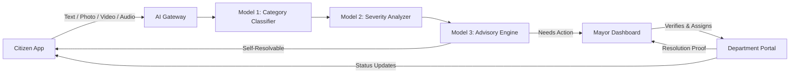
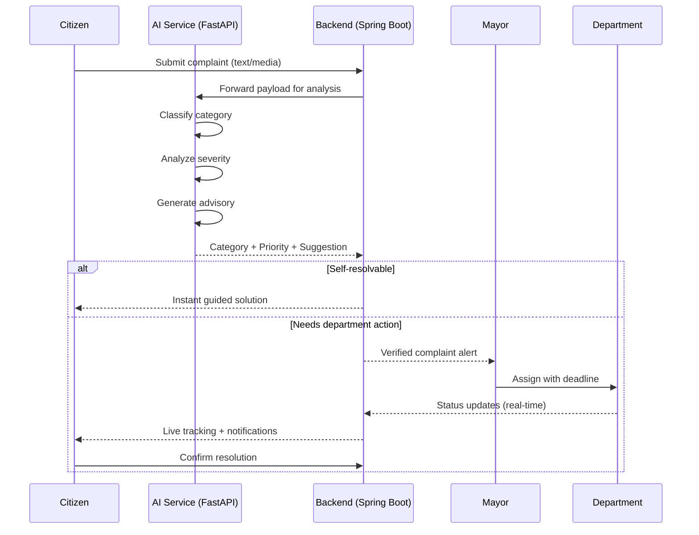

<div align="center">


# 🌉 NagarSetu

### AI‑Powered Smart City Governance Platform

<p>
  <a href="https://github.com/yourusername/NagarSetu">
    
  </a>
</p>

<h3><em>"Your Voice. Verified. Resolved."</em></h3>

<p align="center">
  
  
  
  
</p>

<p align="center">
  
</p>

<p align="center">
  <sub>📄 Case Status: <b>ACTIVE DEVELOPMENT</b> &nbsp;·&nbsp; 🏛️ Sector: <b>Civic Tech / GovTech</b> &nbsp;·&nbsp; 🧾 License: <b>MIT</b></sub>
</p>

</div>

<hr>

<div align="center">

**Frontend**
<br>


**Backend**
<br>


**Data & Infra**
<br>


</div>

<hr>

## 📑 Table of Contents
<details open>
<summary>Click to expand / collapse</summary>

- [How NagarSetu Works](#-how-nagarsetu-works-simple-explanation)
- [Introduction](#-introduction)
- [Problem Statement](#-problem-statement)
- [Before / After NagarSetu](#-before--after-nagarsetu)
- [Project Architecture](#-project-architecture)
- [AI Pipeline](#-ai-pipeline)
- [Features](#-features)
- [Technology Stack](#-technology-stack)
- [System Workflow](#-system-workflow)
- [Folder Structure](#-folder-structure)
- [Installation](#-installation)
- [API Endpoints](#-api-endpoints)
- [Screenshots](#-screenshots)
- [Roadmap](#-roadmap)
- [Contributing](#-contributing)
- [License](#-license)

</details>

<hr>

## 🧒 How NagarSetu Works (Simple Explanation)

> Imagine you are playing outside and notice a giant, dangerous hole in the sidewalk.
>
> Normally, the grown-ups would have to figure out which government building handles sidewalks, go there, fill out confusing paper forms, and then wait for months without ever knowing if anyone is actually going to fix it.
>
> **NagarSetu** is a smart app that changes all of that.

1. 📸 You take a picture of the hole with your phone and tap **Send**.
2. 🧠 The app's AI instantly looks at the picture, realizes it is a **Road** problem, and sees that it is a **High Risk** danger.
3. 🚨 It immediately alerts the exact person whose job it is to fix the roads and starts a strict countdown clock.
4. 📦 You watch the progress on your phone, step-by-step — just like tracking a pizza delivery!

No paperwork. No confusion. Just a direct bridge between you and the people who can fix the problem.

<hr>

## 🏛️ Introduction

**NagarSetu** (meaning *"Bridge"* in Sanskrit/Hindi) is a next-generation civic technology platform designed to eliminate the slow, opaque, and paper-driven complaint processes currently paralyzing municipal corporations.

By leveraging a **tri-model Artificial Intelligence pipeline**, NagarSetu provides every citizen with a verified, digital channel connecting them directly to city administration. The system automatically categorizes issues, evaluates severity, routes the ticket to the correct department, and enforces publicly visible resolution deadlines.

## ⚠️ Problem Statement

Municipal grievance redressal today suffers from severe structural bottlenecks:

| Pain Point | Impact |
|---|---|
| 🗂️ **Manual Fragmentation** | Complaints bounce between disconnected departments via physical files |
| 🕳️ **Zero Visibility** | Citizens have no way to track the status of their submissions |
| ⚖️ **Lack of Prioritization** | A catastrophic water main break sits in the same queue as a cosmetic issue |
| 🙈 **No Accountability** | Deadlines are non-existent, and delays go unrecorded |

## 🔁 Before / After NagarSetu

| | Without NagarSetu | With NagarSetu |
|---|---|---|
| **Filing a complaint** | Physical forms, multiple offices | 30-second photo/text/audio submission |
| **Routing** | Manual, error-prone | AI-classified & auto-routed in seconds |
| **Urgency** | First-come, first-served | Risk-based `HIGH_ALERT` → `GENERAL` tiers |
| **Tracking** | None | Live status stream, pizza-tracker style |
| **Accountability** | No deadlines | Enforced, publicly logged deadlines |

<hr>

## 🏗️ Project Architecture





## 🤖 AI Pipeline

NagarSetu does not rely on a single monolithic model. Instead, three specialized models work in sequence, each independently trainable and auditable:

| # | Model | Role | Input | Output |
|---|---|---|---|---|
| 1 | **Category Classifier** | Identifies the correct civic department | Text, image, video, audio | Category (Roads, Water, Electricity, Sanitation, Consumer Rights, etc.) |
| 2 | **Severity Analyzer** | Assesses urgency and risk | Text + media + metadata (location, time) | Priority tier: `HIGH_ALERT` / `HIGH` / `MEDIUM` / `GENERAL` |
| 3 | **Advisory Engine** | Determines self-resolvability | Category + severity + complaint context | Step-by-step citizen guidance, or forward-to-department flag |

> Every model decision is logged with input hash, confidence score, and model version for full auditability. Low-confidence outputs (below a configurable threshold) are automatically flagged for human review before routing.

<hr>

## ✨ Features

<table>
<tr>
<td width="50%">

**📝 Instant Digital Filing**
Text, photo, video, and audio submission — zero paperwork.

**🤖 AI Categorization & Severity**
Automatic department routing with priority tagging.

**🚨 High-Alert Routing**
Fire, flood, landslide cases bypass the standard queue.

**💡 AI Self-Help Suggestions**
Citizen-solvable issues get instant guided solutions.

**📍 Real-Time Tracking**
`Submitted → Verified → Assigned → In Progress → Resolved`.

**⏱️ Deadline Enforcement**
Every complaint carries a visible target resolution date.

</td>
<td width="50%">

**🔓 Controlled Deadline Extension**
Extensions require a logged, mandatory justification.

**🔐 Role-Based Dashboards**
Dedicated, secure interfaces for Citizens and the Mayor's office.

**🪪 KYC Verification**
One-time identity verification before complaint submission.

**🏢 Department Routing Engine**
Auto-assignment to Roads, Water, Electricity, Sanitation, etc.

**🗺️ Geo-Clustering**
PostGIS-powered duplicate detection for nearby complaints.

**⭐ Rating & Feedback**
Post-resolution ratings feed department accountability scores.

</td>
</tr>
</table>

## 🧰 Technology Stack

| Layer | Technology |
|---|---|
| **Frontend** | React, JavaScript, Vite, TailwindCSS |
| **Backend / API** | Java 21, Spring Boot, Spring Security, Spring Data JPA |
| **AI / ML Microservice** | Python, FastAPI, PyTorch / scikit-learn, Transformers |
| **Database** | PostgreSQL + PostGIS |
| **Auth** | JWT with role-based access control (RBAC) |
| **Real-Time Layer** | WebSockets (STOMP) / Kafka |
| **Media Storage** | S3-compatible object storage |
| **Notifications** | Firebase Cloud Messaging + SMS Gateway |
| **Containerization** | Docker, Docker Compose |
| **CI/CD** | GitHub Actions |

## 🔄 System Workflow

1. **Citizen Registration** → One-time KYC verification.
2. **Complaint Submission** → Text / photo / video / audio.
3. **AI Classification** → Category + Severity + Advisory generated in seconds.
4. **Self-Resolvable?** → Yes: instant guidance sent to citizen. No: forwarded onward.
5. **Mayor Verification** → Complaint reviewed and assigned to the correct department with a deadline.
6. **Department Action** → Real-time status updates as work progresses.
7. **Citizen Confirmation** → Citizen verifies resolution with photo proof or reopens the case.
8. **Emergency Path** → `HIGH_ALERT` complaints bypass the queue and notify the Mayor and department simultaneously.

<hr>

## 📂 Folder Structure

<details>
<summary>Expand full tree</summary>

```
NagarSetu/
├── frontend/                   # React + JavaScript client (Citizen & Mayor dashboards)
│   ├── src/
│   │   ├── components/
│   │   ├── pages/
│   │   │   ├── citizen/
│   │   │   └── mayor/
│   │   ├── hooks/
│   │   ├── services/            # API clients
│   │   └── App.tsx
│   └── package.json
│
├── backend/                    # Spring Boot core service
│   ├── src/main/java/com/nagarsetu/
│   │   ├── auth/                 # JWT, KYC verification
│   │   ├── complaint/             # Complaint entity, controller, service
│   │   ├── department/
│   │   ├── mayor/
│   │   ├── notification/
│   │   └── websocket/
│   ├── src/main/resources/
│   │   └── application.yml
│   └── pom.xml
│
├── ai-service/                 # Python FastAPI AI microservice
│   ├── app/
│   │   ├── models/
│   │   │   ├── classifier.py       # Model 1
│   │   │   ├── severity_analyzer.py # Model 2
│   │   │   └── advisory_engine.py   # Model 3
│   │   ├── routers/
│   │   ├── schemas/
│   │   └── main.py
│   ├── requirements.txt
│   └── Dockerfile
│
├── database/
│   ├── migrations/
│   └── seed/
│
├── docker-compose.yml
├── .env.example
└── README.md
```

</details>

## ⚙️ Installation

### Prerequisites
- Node.js ≥ 18
- Java ≥ 21 & Maven
- Python ≥ 3.10
- PostgreSQL ≥ 15 (with PostGIS extension)
- Docker & Docker Compose (recommended)

### 1. Clone the repository
```bash
git clone https://github.com/yourusername/NagarSetu.git
cd NagarSetu
```

### 2. Configure environment variables
```bash
cp .env.example .env
# then edit .env with your DB credentials, JWT secret, and API keys
```

### 3. Run with Docker Compose (recommended)
```bash
docker-compose up --build
```

### 4. Manual setup (alternative)

<details>
<summary><b>Backend (Spring Boot)</b></summary>

```bash
cd backend
mvn clean install
mvn spring-boot:run
```
</details>

<details>
<summary><b>AI Service (FastAPI)</b></summary>

```bash
cd ai-service
python -m venv venv
source venv/bin/activate   # Windows: venv\Scripts\activate
pip install -r requirements.txt
uvicorn app.main:app --reload --port 8000
```
</details>

<details>
<summary><b>Frontend (React)</b></summary>

```bash
cd frontend
npm install
npm run dev
```
</details>

The app will be available at:

| Service | URL |
|---|---|
| Frontend | `http://localhost:5173` |
| Backend API | `http://localhost:8080` |
| AI Service | `http://localhost:8000` |

<hr>

## 🔌 API Endpoints

| Method | Endpoint | Description | Role |
|---|---|---|---|
| `POST` | `/api/auth/signup` | Register a new citizen account | Public |
| `POST` | `/api/auth/login` | Authenticate and receive JWT | Public |
| `POST` | `/api/kyc/verify` | Submit KYC documents for verification | Citizen |
| `POST` | `/api/complaints` | File a new complaint (text/media) | Citizen |
| `GET` | `/api/complaints/{id}` | Get complaint details & status | Citizen / Mayor |
| `GET` | `/api/complaints/my` | List complaints filed by the logged-in citizen | Citizen |
| `PATCH` | `/api/complaints/{id}/confirm` | Confirm resolution or reopen a case | Citizen |
| `GET` | `/api/mayor/complaints` | List all incoming verified complaints | Mayor |
| `PATCH` | `/api/mayor/complaints/{id}/assign` | Assign complaint to a department | Mayor |
| `PATCH` | `/api/mayor/complaints/{id}/extend-deadline` | Extend resolution deadline with justification | Mayor |
| `GET` | `/api/mayor/analytics` | Ward-wise and department-wise analytics | Mayor |
| `PATCH` | `/api/department/complaints/{id}/status` | Update complaint progress status | Department |
| `POST` | `/ai/classify` | Internal: category classification | AI Service |
| `POST` | `/ai/severity` | Internal: severity & priority scoring | AI Service |
| `POST` | `/ai/advisory` | Internal: self-resolution suggestion generation | AI Service |
| `WS` | `/ws/complaints/{id}` | Real-time complaint status stream | Citizen / Mayor |

## 🖼️ Screenshots

> Add product screenshots or GIFs here once the UI is built — citizen complaint flow, Mayor dashboard, live tracking view, and analytics panel are recommended.

| Citizen Dashboard | Mayor Dashboard |
|---|---|
| `<screenshot placeholder>` | `<screenshot placeholder>` |

## 🗺️ Roadmap

- [x] Core complaint submission flow (text, photo, video, audio)
- [x] Tri-model AI pipeline (classification, severity, advisory)
- [x] Role-based Citizen & Mayor dashboards
- [x] KYC verification module
- [x] Real-time tracking with WebSockets
- [ ] Community upvoting & duplicate complaint merging (geo-clustering)
- [ ] Department performance leaderboard
- [ ] SOS / emergency panic button with direct responder integration
- [ ] Public ward-wise transparency dashboard
- [ ] Multilingual & voice/IVR support
- [ ] AI chatbot for pre-filing assistance
- [ ] Blockchain-based tamper-proof audit ledger
- [ ] Multi-city / state-level deployment framework

## 🤝 Contributing

Contributions are welcome. Please fork the repository, create a feature branch, and open a pull request describing your changes.

```bash
git checkout -b feature/your-feature-name
git commit -m "Add: your feature description"
git push origin feature/your-feature-name
```

## 📜 License

This project is licensed under the MIT License — see the [LICENSE](LICENSE) file for details.

<hr>

<div align="center">

**NagarSetu** — *Your Voice. Verified. Resolved.*

<sub>Built for cities that want to listen.</sub>

</div>
